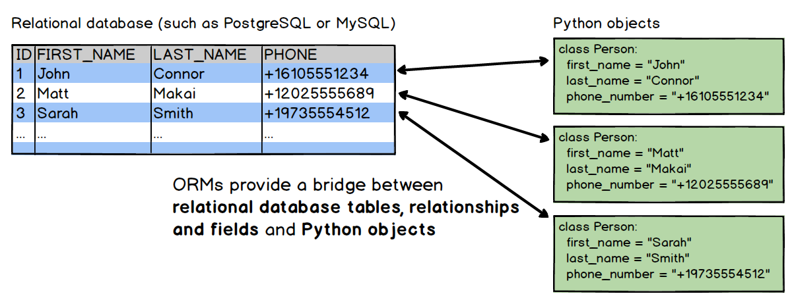

**JPA - Table of Contents**
- [The Problems 🐛](#the-problems-%f0%9f%90%9b)
- [JDBC vs JPA, 1 on 1 fight 🥋](#jdbc-vs-jpa-1-on-1-fight-%f0%9f%a5%8b)
- [The Solution - **JPA**](#the-solution---jpa)
- [JPA major components](#jpa-major-components)
- [Concept of entity](#concept-of-entity)
- [How do we program for JPA](#how-do-we-program-for-jpa)
- [Persistent.xml](#persistentxml)

# The Problems 🐛
- when using JDBC rows in Relations(Tables) are not objects which leads to manual translation between JAVA class attributes and a column of a DB row
- Lots of programming overhead [when done using JDBC, or so] for very common tasks like following
	- Converting from row to object 
	- Rowset to ArrayList
	- manually opening, closing Database connection
	- Hardwired with "database schema"
	- DB dependent SQL code
	- a lot of non business logic related code comes in way of development


---


# JDBC vs JPA, 1 on 1 fight 🥋
- comparison by code for getting list of book from DB 👩‍💻
````java
// JDBC
ArrayList<Book> books = new ArrayList<>();
Connection con = DriverManager.getConnection(DB_URL, USER, PWD);
Statement stmt = con.createStatement();
ResultSet rs =  stmt.executeQuery("select * from books.book");
while(rs.next())
{
	Book book = new Book();
	book.setIsbn(rs.getString("isbn"));
	book.setTitle(rs.getString("title"));
	book.setPrice(rs.getDouble("price"));
	book.setStock(rs.getInt("stock"));
	Books.add(book);
}

// JPA
String qstr = "select book from BookEntity as book";
TypedQuery<Book> qt = em.createQuery(qstr, Book.class);
List<Book> books = qt.getResultList();

// The winner 🙌
// 🎆 JPA 🎇 obviously

````


---


# The Solution - **JPA**
- JPA i.e., Java Persistent API is an  Object Relational Mapping (ORM) framework.
- JPA solves or atleast improves approach to all the above listed issues.
- in laymens language - JPA maps Java classes with the DB tables
- so you manipulate the java class object(Entities) representating the tables(Relations) and the changes are reflected in DB accordingly
- JPA provides high level API that simplifies and automates most of related tasks.
- JPA itself is just a "specification", not a product.
- Here are the popular implementation of JPA
  - Hibernate
  - Eclipse Link
  - Apache Open JPA
  - Oracle’s Top Link 
- JPA can be used in "standalone application" or in any "application server context"


---


# JPA major components
1. Object/Relational mapping Metadata
   - can be specified directly in the entity class using annotations or in a separate XML descriptor file
2. The API
   - defined in the `javax.persistence package`
3. The Java Persistence Query Language (JPQL) 
   - used to make queries against entities stored in a relational database 
   - resembles SQL but operates against entity objects rather than database tables 

# Concept of entity
- An enitty is a java class that represents the DB relation and is to be persisted into DB over applictions lifecycle.
- Entity class is
  - Like any other plain java class "POJO" (Plain Old Java Object).
    - Has fields, getter/setter methods, etc.
  - Defines "object" to "table" mapping
  	- Object typically represents a row in a table
  - Defines identifying attribute (corresponding to key of table) for the object.
- Examples - Person, Employee, Book etc


# How do we program for JPA
- Create Entity classes for all tables that are to be manipulated.
- Mapping between entity class and database table are to be specified in Entities class using appropriate annotations.
  - Older style is through XML file
- Define a Persistent Unit in “persistent.xml” (example next) and place it in “META-INF” directory.
- Performing persistence operation by taking appropriate services of Entity Manager class

# Persistent.xml
````xml
<?xml version="1.0" encoding="UTF-8" ?>
<persistence xmlns:xsi="http://www.w3.org/2001/XMLSchema-instance"
    xsi:schemaLocation="http://java.sun.com/xml/ns/persistence http://java.sun.com/xml/ns/persistence/persistence_2_0.xsd"
    version="2.0" xmlns="http://java.sun.com/xml/ns/persistence">
  <persistence-unit name="todos" transaction-type="RESOURCE_LOCAL">
		<class>de.vogella.jpa.simple.model.Todo</class>
		<properties>
			<property name="javax.persistence.jdbc.driver" value="org.apache.derby.jdbc.EmbeddedDriver" />
			<property name="javax.persistence.jdbc.url"
				value="jdbc:derby:/home/vogella/databases/simpleDb;create=true" />
			<property name="javax.persistence.jdbc.user" value="test" />
			<property name="javax.persistence.jdbc.password" value="test" />

			<!-- EclipseLink should create the database schema automatically -->
			<property name="eclipselink.ddl-generation" value="create-tables" />
			<property name="eclipselink.ddl-generation.output-mode" value="database" />
		</properties>
	</persistence-unit>
</persistence>
````


