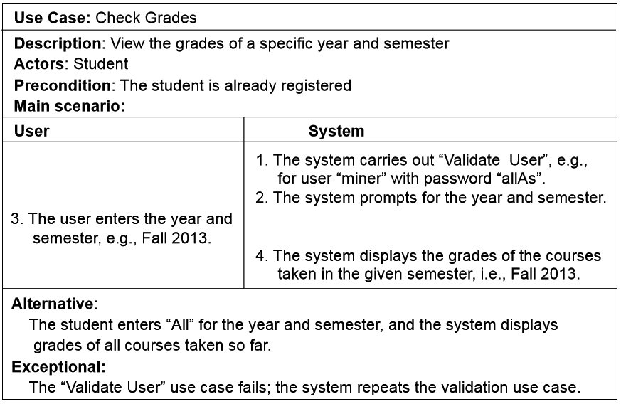

**UML - Table of Contents**
- [UML](#uml)
	- [Class Diagram](#class-diagram)
		- [Notation of **a** class](#notation-of-a-class)
		- [Multiplicity](#multiplicity)
	- [Use case](#use-case)
		- [Use Case Scenario](#use-case-scenario)
	- [Sequence diagram](#sequence-diagram)

# UML
## Class Diagram
- A class diagram is a graph including
  - Nodes representing classes (types of objects), Nodes can have just a name, or expose some internal structure 
  - Links representing relationships among classes
    - **Association**
      - denoted by **———— or ————>**  
      - permanent, structural, has a relation
      - Solid line (arrowhead optional) 
    - **Dependency** 
      - denoted by **--------|>** 
      - Temporary, “uses a” relation
      - temporary as used in arguement, returned or created inside a function
      - Dotted line with arrowhead 
    - **Inheritance/Generalisation** 
      - denoted by **————————►**
      - Inheritance, “is a” relation 
      - Solid line with open (triangular) arrowhead from child towards parent
      - generally from bottom to top
    - Aggregation - 
      - denoted by **<>——————** , empty diamond
      - part **can** exist without whole
    - composition - 
      - denoted by **◄►——————** , solid diamond
      - stronger form of aggregation
			- part **cannot** exist without whole
  	- direction of arrows 
    	- id A is dependent on B or have "has a" relation with B, arrow goes from A to B 
    - Links can have multiplicities and/or names for roles played by participants
  - comment box

### Notation of **a** class
- it is a verical standing rectangle with 3 compartments/rows
- The top compartment shows the class name 
- The middle compartment contains the  declarations of the fields, attributes or properties of the class
- The bottom compartment contains the  declarations of the methods of the class
- example
	

### Multiplicity
- put this multiplicity on both sides of a relation
    
Symbol			|	Meaning
------------|---------------------------
- __*__			| 0, 1, or more
- __X__			| exactly X
- __X..Y__	| between X and Y, inclusive 
- __X..*__	| X or more

- e.g., 
  - __2..* ———————— 5..*__
    - each one on left should have atleast 5 of right side entity
    - each on on right should have atleast 2 of left side entity

## Use case
- actor, outside use case boundary
- use cases, oval shaped
- relationships
  - associations between users
  - extension or generalisatione between users
  - dependency among use cases using
    - include
      - when a use case is compulsory for another use case
    - extends
      - when a use case is optional for another use case
- comment box

### Use Case Scenario
- consists of
  - Use case name
  - description
  - precondition (if any)
  - main scenarios (list)
    - the main scenarios are executed in sequence of numbers
	- alternative
  	- alternative action if any
	- exceptional
  	- execution when precondition fails
  

## Sequence diagram

